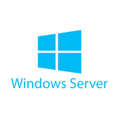
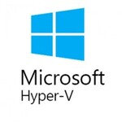
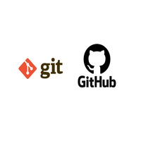

## 👋 Hello! Nice to meet you

## 👨‍💻📚 About Me

I'm **Juan Martín Franco**, a student pursuing a Bachelor's Degree in Information Systems at the Universidad Nacional de Luján (UNLu). I have a deep passion for technology, with a strong focus on IT support. I am constantly learning and improving my skills through both academic study and personal projects.

## 📑 Table of Contents

1. [👨‍💻 About Me](#-about-me)
2. [💻 Hard - Skills](#-hard---skills)
3. [💭 Soft - Skills](#-soft---skills)
4. [📚 Practical Assignments](#-practical-assignments)
5. [🚀 Projects](#-projects)
6. [📄 Curriculum Vitae / Resume](#-curriculum-vitae--resume)
7. [📫 How to reach me:](#-how-to-reach-me)

## 💻 Hard - Skills

* ***Windows Operating Systems (Windows Server [2016/2022], Windows 7, Windows 10 & Windows 11)***
    
    
    
    
    

* ***Active Directory (On-Premises & Azure Active Directory)***
    
    
    

* ***Group Policy Objects (GPOs)***
    
        

* ***Microsoft 365***
    
    

* ***VPN Configuration***
    
    

* ***Virtualization (Hyper-V, VMWare & VirtualBox)***
    
    
    
    

* ***PowerShell***
    
    

* ***Linux (Debian, Ubuntu & Fedora)***
    
    
    
    

* ***Monitoring (Zabbix y Grafana)***
    
    
    

* ***Software Deployment (PDQ Deploy)***
    
    

* ***Remote Access and Troubleshooting (TeamViewer & AnyDesk)***
    
    
    

* ***Ticketing System (Jira Service Management)***
    
    

* ***Version Control (Git & GitHub)***
    
    

## 💭 Soft - Skills

* Self-taught
* Team Work
* Organized
* Analytical thinking
* Positive mindset

## 📚 Practical Work

### Teleinformática y Redes
- [Teleinformática y Redes - Practical Assignments](https://github.com/JuanmaFranco/TyR-TPS)

### Administración y Gestión de Redes
- [Administración y Gestión de Redes - Practical Assignments](https://github.com/JuanmaFranco/AyGR-TPS)

## 🚀 Projects

* **Java Projects**

  * [Project 1: Spring MySQL REST API](https://github.com/JuanmaFranco/spring-mysql-rest-api):
    A project showcasing the creation of a RESTful API using Spring Boot, MySQL, and Hibernate.

  * [Project 2: Spring MVC Customer Management](https://github.com/JuanmaFranco/spring-mvc-customer-management):
    An interactive web application built with Spring MVC for managing customer data.

  * [Project 3: Shopme E-commerce (Under development)](https://github.com/JuanmaFranco/Shopme-Ecommerce):
    An e-commerce platform leveraging a range of technologies, including Spring Boot and Hibernate, for smooth functionality.

* **IT Support Projects**

  * [Project 1: IT Support Homelab](https://github.com/JuanmaFranco/HomeLab):
    A comprehensive homelab project simulating a real-world IT environment. It includes the setup of Windows Server 2022, Active Directory, Azure Active Directory, Microsoft 365, and network configurations such as VPNs. This project demonstrates key IT support skills, including user management, system administration, software deployment, remote troubleshooting, and monitoring through Zabbix and Grafana.

Feel free to explore these projects and get a glimpse of my technical expertise and problem-solving skills.

## 📄 Resume / CV

English Version:

  - [Juan Martin Franco's Resume](resume/Juan%20Martín%20Franco's%20Resume.pdf)

Spanish Version:

  - [Juan Martín Franco - Curriculum Vitae](resume/CV%20-%20Juan%20Martin%20Franco.pdf)

## 📫 How to reach me:

📧 Email: juanmartin_franco@hotmail.com  
📱 Cell Phone: +54 2325 65 1813  
🔗 LinkedIn: [Juan Martín Franco](https://www.linkedin.com/in/juanmafranco/)  
🔗 Medium: [Juan Martín Franco - Medium](https://medium.com/@juanmartin_franco)  
🔗 Gitbook: [Juan Martín Franco - Gitbook](https://juan-martin-franco.gitbook.io)  

Thank you for taking the time to explore my profile! 

If you have any questions, ideas, or even a potential job opportunity in mind, please don't hesitate to reach out at any time. 

I look forward to the possibility of connecting and exploring new opportunities!