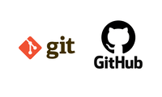
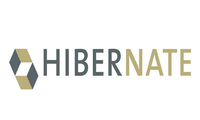
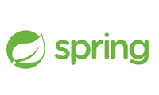

## 👋 Hello! Nice to meet you

### About Me

I'm **Juan Martín Franco**, a passionate student on a journey to pursue a Bachelor's Degree in Information Systems at the Universidad Nacional de Luján (UNLu). 

### My Professional Journey and Aspirations

I am deeply passionate about advancing my career within the dynamic realm of the IT industry. Specifically, my focus lies in becoming a skilled Backend Developer, leveraging my proficiency in technologies like Spring Framework, Hibernate, and MySQL to architect robust and efficient systems. My aspiration, however, extends beyond just one role, as I remain open to exploring various avenues within the IT field as my journey progresses.

Driven by a relentless thirst for knowledge, I actively seek opportunities to enhance my skill set both within the structured academic environment of the Universidad Nacional de Luján (UNLu) and through self-directed learning. This dual approach has equipped me with a unique blend of theoretical foundation and hands-on experience, positioning me to make valuable contributions to any organization that recognizes and nurtures my potential.

My ultimate goal is to channel the expertise I have gained into a professional setting, collaborating with a forward-thinking company that shares my vision for innovative solutions and cutting-edge technologies. I am committed to continuously honing my craft, producing high-quality code, and refining my English language skills to effectively communicate and collaborate with diverse teams on a global scale.

In essence, I am driven by a fervent desire to create impact through technology and contribute meaningfully to the evolution of the IT landscape. As I embark on this journey, I am excited to embrace new challenges, embrace continuous learning, and foster innovation within the industry.

## 💻 Hard - Skills

* ***Python 3***

    

* ***Java 17***

    

* ***MySQL***
  
    

* ***Git & Github***

    

* ***Hibernate***

    

* ***Spring Framework 6 & Spring Boot 3***

    

## 💭 Soft - Skills

* Self-taught
* Team Work
* Organized
* Analytical thinking
* Positive mindset

## 📚 Practical Assignments

### Teleinformática y Redes
- [Teleinformática y Redes - Practical Assignments](https://github.com/JuanmaFranco/TyR-TPS)

### Administración y Gestión de Redes
- [Administración y Gestión de Redes - Practical Assignments](https://github.com/JuanmaFranco/AyGR-TPS)

## 🚀 Projects

* [Project 1: Spring MySQL REST API](https://github.com/JuanmaFranco/spring-mysql-rest-api):
    A project showcasing the creation of a RESTful API using Spring Boot, MySQL, and Hibernate.

* [Project 2: Spring MVC Customer Management](https://github.com/JuanmaFranco/spring-mvc-customer-management):
    An interactive web application built with Spring MVC for managing customer data.

* [Project 3: Shopme E-commerce (Under development)](https://github.com/JuanmaFranco/Shopme-Ecommerce):
    An e-commerce platform leveraging a range of technologies, including Spring Boot and Hibernate, for smooth functionality.

Feel free to explore these projects and get a glimpse of my technical expertise and problem-solving skills.

## 📄 Curriculum Vitae / Resume

English Version:

  - [Juan Martin Franco's Resume](resume/Juan%20Martín%20Franco's%20Resume.pdf)

Spanish Version:

  - [Juan Martín Franco - Curriculum Vitae](resume/CV%20-%20Juan%20Martin%20Franco.pdf)

## 📫 How to reach me:

📧 Email: juanmartin_franco@hotmail.com  
📱 Cell Phone: +54 2325 65 1813  
🔗 LinkedIn: [Juan Martín Franco](https://www.linkedin.com/in/juanmafranco/)  
🔗 Medium: [Juan Martín Franco - Medium](https://medium.com/@juanmartin_franco)  
🔗 Gitbook: [Juan Martín Franco - Gitbook](https://juan-martin-franco.gitbook.io)  

Thank you for taking the time to explore my profile! 

If you have any questions, ideas, or even a potential job opportunity in mind, please don't hesitate to reach out at any time. 

I look forward to the possibility of connecting and exploring new opportunities!