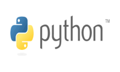
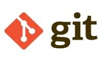

## 👋 Hi! Nice to meet you

### Who Am I?
My name is **Juan Martín Franco**, I am a student of the Bachelor's Degree in Information Systems at the National University on Luján (UNLu).
I was born in Carmen de Areco but i'm currently living in Luján (Buenos Aires).
 

### What are my interests?
I have a great interest in developing as a professional in the IT industry, although I am also passionate about data and how it influences decision making so i would have no problem migrating to the data science/analysis area if necessary.

I’m currently learning Spring Framework and Hibernate, also i'm working on an e-commerce project that includes the following technologies: 
- Spring Boot
- Hibernate
- MySQL
- Heroku deployment 

## 💻 Hard - Skills

* ***Python***

    

* ***Java 8***

    

* ***SQL***
  
    

* ***Git & Github***

    

## 💭 Soft - Skills

* Self-taught
* Team Work
* Organized
* Analytical thinking
* Positive mindset

## 📫 How to reach me:

📧 Email: juanmartin_franco@hotmail.com  
📱 Cell Phone: +54 2325 65 1813  
🔗 LinkedIn: [Juan Martín Franco](https://www.linkedin.com/in/juanmafranco/)

<!--
**JuanmaFranco/JuanmaFranco** is a ✨ _special_ ✨ repository because its `README.md` (this file) appears on your GitHub profile.

Here are some ideas to get you started:

- 🔭 I’m currently working on ...
- 🌱 I’m currently learning ...
- 👯 I’m looking to collaborate on ...
- 🤔 I’m looking for help with ...
- 💬 Ask me about ...
- 📫 How to reach me: ...
- 😄 Pronouns: ...
- ⚡ Fun fact: ...
-->
