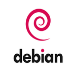

## 👋 Hello! Nice to meet you

## 👨‍💻 About Me

I'm **Juan Martín Franco**, a student pursuing a Bachelor's Degree in Information Systems at the Universidad Nacional de Luján (UNLu). I have a deep passion for technology, with a strong focus on IT support. I am constantly learning and improving my skills through both academic study and personal projects.

## 📑 Table of Contents

1. [👨‍💻 About Me](#-about-me)
2. [💻 Hard - Skills](#-hard---skills)
3. [💭 Soft - Skills](#-soft---skills)
4. [📚 Practical Work](#-practical-work)
5. [📜 Certifications](#-certifications)
6. [🚀 Projects](#-projects)
7. [📄 Curriculum Vitae / Resume](#-curriculum-vitae-cv--resume)
8. [📫 How to reach me](#-how-to-reach-me)

## 💻 Hard - Skills

* ***Windows Operating Systems (Windows Server [2016/2022], Windows 7, Windows 10 & Windows 11)***
    
    
    
    
    

* ***Active Directory (On-Premises & Azure Active Directory)***
    
    
    

* ***Group Policy Objects (GPOs)***
    
        

* ***Productivity and Collaboration Tools (Microsoft 365, G-Suite, Discord & Slack)***
    
    
    
    
    

* ***Virtualization (Hyper-V, VMWare & VirtualBox)***
    
    
    
    

* ***PowerShell***
    
    

* ***Linux (Debian, Ubuntu & Fedora)***
    
    
    
    

* ***Monitoring (Zabbix y Grafana)***
    
    
    

* ***Software Deployment (PDQ Deploy)***
    
    

* ***Remote Access and Troubleshooting (TeamViewer & AnyDesk)***
    
    
    

* ***Ticketing System (Jira Service Management)***
    
    

* ***Version Control (Git & GitHub)***
    
    
    

## 💭 Soft - Skills

* Self-taught
* Team Work
* Effective Communication
* Empathy
* Problem Solving
* Positive Attitude

## 📚 Practical Work

### Teleinformática y Redes
- [Teleinformática y Redes - Practical Work](https://github.com/JuanmaFranco/TyR-TPS)

### Administración y Gestión de Redes
- [Administración y Gestión de Redes - Practical Work](https://github.com/JuanmaFranco/AyGR-TPS)

## 📜 Certifications

- **Google IT Support Professional Certificate**  
    
  *Issued by Google via Coursera*  
  [View certification](/certificates/google%20it%20support%20specialist/google_it_support.pdf)

- **English Certificates - Instituto Británico de Cultura Inglesa (IBCI)**   
  

  - [1st Form Inferior (2004)](/certificates/english%20certificates/1st%20Form%20Inferior/1st%20Form%20Inferior.pdf)

  - [1st Form Superior (2005)](/certificates/english%20certificates/1st%20Form%20Superior/1st%20Form%20Superior.pdf)
  
  - [2nd Form (2006)](/certificates/english%20certificates/2nd%20Form/2nd%20Form.pdf)

  - [Elementary (2007)](/certificates/english%20certificates/Elementary/Elementary.pdf)

  - [2nd Year (2009)](/certificates/english%20certificates/2nd%20Year/2nd%20Year.pdf)
  
  - [3rd Year (2010)](/certificates/english%20certificates/3rd%20Year/3rd%20Year.pdf)

## 🚀 Projects

* **IT Support Projects**

  * [Project 1: IT Support Homelab](https://github.com/JuanmaFranco/HomeLab):
    A comprehensive homelab project simulating a real-world IT environment. It includes the setup of Windows Server 2022, Active Directory, Azure Active Directory, Microsoft 365, and network configurations such as VPNs. This project demonstrates key IT support skills, including user management, system administration, software deployment, remote troubleshooting, and monitoring through Zabbix and Grafana. Additionally, PowerShell was used to automate user creation and management tasks, and Group Policy Objects (GPOs) were implemented to enforce security policies and configurations across the environment.

  * [Project 2: Powershell Automation Script (Under Development)](https://github.com/JuanmaFranco/Powershell-Script):
    This project focuses on automating administrative tasks in Active Directory using PowerShell. It includes scripts for bulk user creation and disabling, enhancing efficiency and consistency in user management. The automation process reduces manual effort and minimizes human error, while allowing customization of user attributes. Overall, this project showcases essential skills in task automation, IT support, and the effective use of PowerShell to streamline operations.

* **Java Projects**

  * [Project 1: Spring MySQL REST API](https://github.com/JuanmaFranco/spring-mysql-rest-api):
    A project showcasing the creation of a RESTful API using Spring Boot, MySQL, and Hibernate.

  * [Project 2: Spring MVC Customer Management](https://github.com/JuanmaFranco/spring-mvc-customer-management):
    An interactive web application built with Spring MVC for managing customer data.

  * [Project 3: Shopme E-commerce (Under development)](https://github.com/JuanmaFranco/Shopme-Ecommerce):
    An e-commerce platform leveraging a range of technologies, including Spring Boot and Hibernate, for smooth functionality.

Feel free to explore these projects and get a glimpse of my technical expertise and problem-solving skills.

## 📄 Curriculum Vitae (CV) / Resume

Versión en español:  

  - [CV - Juan Martín Franco](/resume/CV%20-%20%20Juan%20Martin%20Franco.pdf)

English Version: 

  - [Juan Martin Franco's Resume](/resume/Juan%20Martin%20Franco%20-%20Resume.pdf)

## 📫 How to reach me:

📧 Email: juanmartin_franco@hotmail.com  
📱 Cell Phone: +54 2325 65 1813  
🔗 LinkedIn: [Juan Martín Franco](https://www.linkedin.com/in/juanmafranco/)  
🔗 Medium: [Juan Martín Franco - Medium](https://medium.com/@juanmartin_franco)  
🔗 Gitbook: [Juan Martín Franco - Gitbook](https://juan-martin-franco.gitbook.io)  

Thank you for taking the time to explore my profile! 

If you have any questions, ideas, or even a potential job opportunity in mind, please don't hesitate to reach out at any time. 

I look forward to the possibility of connecting and exploring new opportunities!